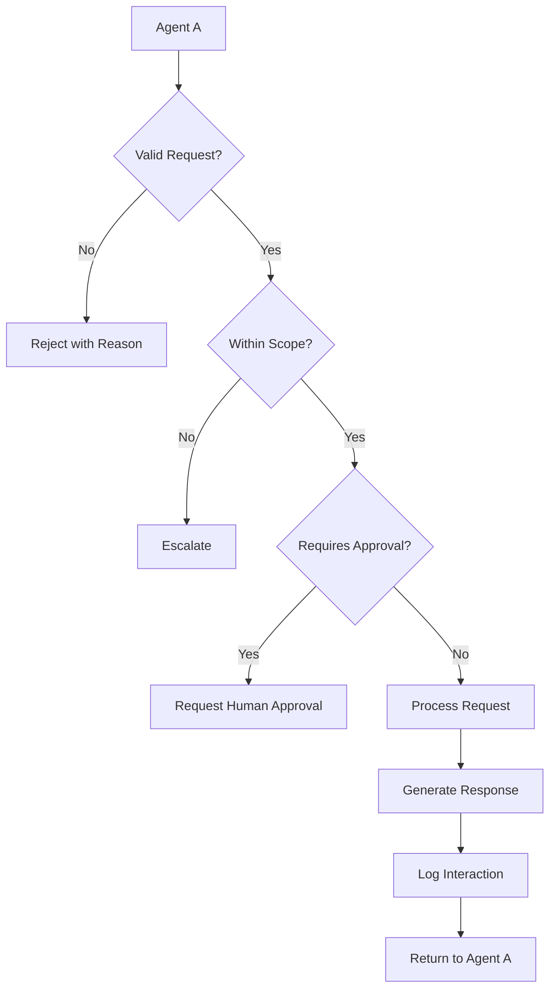
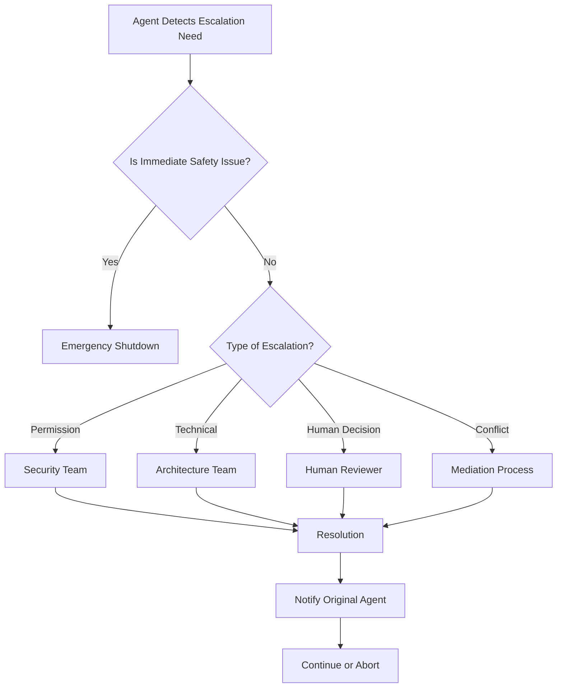
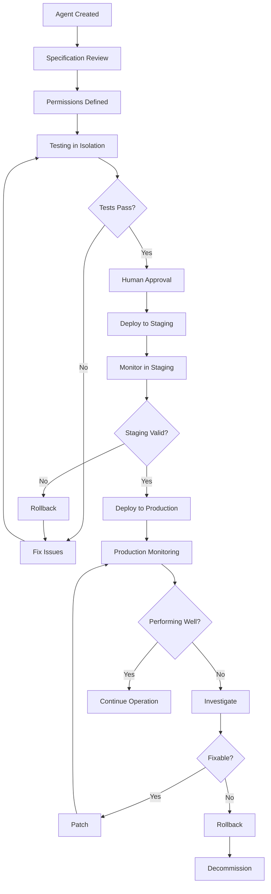

# AI Agent Integration Skill

## Purpose

Control how AI agents interact, communicate, and execute tasks. This skill establishes governance rules for multi-agent systems, ensuring agents operate within defined boundaries, communicate transparently, and cannot make autonomous decisions beyond their specifications.

## Core Principles

### What Agent Integration Means

- **Defined boundaries** - Each agent has clear, non-overlapping responsibilities
- **Transparent communication** - All agent interactions are logged and auditable
- **Controlled permissions** - Tools are explicitly granted, not assumed
- **Safety-first** - Hallucinations and autonomous decisions are prevented
- **Human oversight** - Critical decisions require human approval

### What Agent Integration Is NOT

- **Autonomous operation** - Agents must not make decisions beyond scope
- **Silent changes** - All behavior modifications must be visible
- **Unchecked permissions** - No tool access without explicit grant
- **Black box behavior** - Agent reasoning must be explainable

---

## Agent Responsibilities and Boundaries

### Agent Definition Template

```yaml
agent:
  name: [Agent Name]
  role: [Brief role description]
  version: [1.0.0]

  responsibilities:
    - [Primary responsibility 1]
    - [Primary responsibility 2]

  boundaries:
    - [What this agent WILL NOT do 1]
    - [What this agent WILL NOT do 2]

  inputs:
    - [Data/commands this agent accepts]
    - [Format requirements]

  outputs:
    - [Data this agent produces]
    - [Format and structure]

  escalation_points:
    - [When to escalate 1]
    - [When to escalate 2]
```

### Agent Boundary Examples

**Good - Clear Boundaries**:

```yaml
agent:
  name: CodeReviewAgent
  role: Review code for quality and security issues

  responsibilities:
    - Static code analysis
    - Security vulnerability detection
    - Style guide compliance

  boundaries:
    - WILL NOT modify code directly
    - WILL NOT approve pull requests
    - WILL NOT access production systems
    - WILL NOT make architectural decisions

  inputs:
    - Pull request diff
    - Test results
    - Code coverage reports

  outputs:
    - Review comments
    - Issue severity levels
    - Suggested fixes (not applied)
```

**Bad - Overlapping Boundaries**:

```yaml
# PROBLEMATIC - Responsibilities are unclear and overlapping
agent:
  name: SuperAgent
  role: Do everything related to code

  responsibilities:
    - Review code
    - Write code
    - Deploy applications
    - Monitor systems
    - Make architectural decisions
```

### Agent Registry

```yaml
# agent-registry.yaml

agents:
  - name: SpecAgent
    description: Creates and validates feature specifications
    version: 1.0.0
    owner: Architecture Team
    status: active

  - name: PlanAgent
    description: Creates implementation plans from specifications
    version: 1.0.0
    owner: Architecture Team
    status: active
    depends_on:
      - SpecAgent

  - name: CodeAgent
    description: Implements code based on approved plans
    version: 1.0.0
    owner: Development Team
    status: active
    depends_on:
      - PlanAgent

  - name: TestAgent
    description: Creates and validates tests
    version: 1.0.0
    owner: QA Team
    status: active
    depends_on:
      - CodeAgent

  - name: DeployAgent
    description: Manages deployment lifecycle
    version: 1.0.0
    owner: DevOps Team
    status: active
    depends_on:
      - TestAgent
```

---

## Inter-Agent Communication Rules

### Communication Protocol



### Message Format

```typescript
interface AgentMessage {
  // Message identification
  messageId: string;
  timestamp: ISO8601;
  correlationId: string;

  // Sender information
  sender: {
    agentName: string;
    agentVersion: string;
    requestId: string;
  };

  // Recipient information
  recipient: {
    agentName: string;
    expectedVersion?: string;
  };

  // Message content
  payload: {
    taskType: string;
    taskData: Record<string, unknown>;
    priority: 'low' | 'normal' | 'high' | 'critical';
    deadline?: ISO8601;
  };

  // Context
  context: {
    specification?: string;
    plan?: string;
    taskId?: string;
    userId?: string;
  };

  // Authorization
  authorization: {
    grantedBy: string;
    grantedAt: ISO8601;
    expiresAt?: ISO8601;
    permissions: string[];
  };
}

interface AgentResponse {
  messageId: string;
  correlationId: string;
  status: 'success' | 'partial' | 'failed';
  result?: Record<string, unknown>;
  error?: {
    code: string;
    message: string;
    recoverable: boolean;
  };
  metrics: {
    processingTimeMs: number;
    tokensUsed: number;
  };
  auditTrail: {
    actions: string[];
    decisions: string[];
  };
}
```

### Communication Rules

| Rule | Description | Enforcement |
|------|-------------|-------------|
| **REQ-001** | All messages MUST have correlation ID | Message validation |
| **REQ-002** | All interactions MUST be logged | Audit system |
| **REQ-003** | Agent MUST verify sender identity | Authentication |
| **REQ-004** | Response MUST include processing metrics | Response schema |
| **REQ-005** | Errors MUST include error code and recoverability | Error handling |

### Example Communication

**Request**:

```json
{
  "messageId": "msg-12345",
  "timestamp": "2024-01-15T10:30:00Z",
  "correlationId": "corr-67890",
  "sender": {
    "agentName": "PlanAgent",
    "agentVersion": "1.0.0",
    "requestId": "req-11111"
  },
  "recipient": {
    "agentName": "CodeAgent"
  },
  "payload": {
    "taskType": "IMPLEMENT_FEATURE",
    "taskData": {
      "featureId": "FEAT-001",
      "taskIds": ["T001", "T002", "T003"]
    },
    "priority": "normal"
  },
  "context": {
    "specification": "specs/user-auth/spec.md",
    "plan": "specs/user-auth/plan.md"
  },
  "authorization": {
    "grantedBy": "Human-Auth-System",
    "grantedAt": "2024-01-15T10:00:00Z",
    "permissions": ["code:write", "test:write"]
  }
}
```

**Response**:

```json
{
  "messageId": "msg-12346",
  "correlationId": "corr-67890",
  "status": "success",
  "result": {
    "filesModified": 5,
    "filesCreated": 3,
    "testsWritten": 12
  },
  "error": null,
  "metrics": {
    "processingTimeMs": 45000,
    "tokensUsed": 12500
  },
  "auditTrail": {
    "actions": [
      "Read specification",
      "Read plan",
      "Implement T001",
      "Implement T002",
      "Implement T003",
      "Write tests"
    ],
    "decisions": [
      "Used TypeScript for type safety",
      "Implemented repository pattern for database access"
    ]
  }
}
```

---

## Tool-Calling Permissions

### Permission Levels

| Level | Capability | Example |
|-------|------------|---------|
| **READ** | Read files, APIs, configs | `file:read`, `api:read` |
| **WRITE** | Create/modify files | `file:write`, `api:write` |
| **EXECUTE** | Run commands, scripts | `exec:run`, `command:execute` |
| **DELETE** | Remove files, resources | `file:delete`, `db:delete` |
| **ADMIN** | System-level operations | `system:config`, `user:manage` |

### Permission Matrix

```yaml
# agent-permissions.yaml

permissions:
  SpecAgent:
    - scope: file
      actions: [read, write]
      paths: ["specs/**"]
      conditions: ["must_validate_schema"]

  PlanAgent:
    - scope: file
      actions: [read, write]
      paths: ["specs/**", "plans/**"]
    - scope: command
      actions: [execute]
      commands: ["read-templates", "validate-plan"]

  CodeAgent:
    - scope: file
      actions: [read, write]
      paths: ["src/**", "tests/**"]
    - scope: command
      actions: [execute]
      commands: ["build", "test", "lint"]

  DeployAgent:
    - scope: file
      actions: [read, write]
      paths: ["deploy/**", "config/**"]
    - scope: command
      actions: [execute]
      commands: ["kubectl", "docker", "terraform"]
    - scope: api
      actions: [read, write]
      paths: ["deployments", "releases"]
```

### Tool Calling Protocol

```typescript
interface ToolCall {
  callId: string;
  timestamp: ISO8601;
  agent: {
    name: string;
    version: string;
  };
  tool: {
    name: string;
    version?: string;
  };
  permission: string; // Must match granted permission
  arguments: Record<string, unknown>;
  justification: string; // Why this tool is needed
}

interface ToolResult {
  callId: string;
  status: 'success' | 'failed' | 'denied';
  output?: unknown;
  error?: {
    code: string;
    message: string;
  };
  executionTimeMs: number;
  auditInfo: {
    executedBy: string;
    executedAt: ISO8601;
    permissionsUsed: string[];
  };
}

// Example: Agent requesting tool permission
async function requestToolPermission(
  agentName: string,
  toolName: string,
  justification: string
): Promise<PermissionGrant | PermissionDenied> {
  // Check if agent has permission
  const hasPermission = await verifyPermission(agentName, toolName);

  if (hasPermission) {
    return {
      granted: true,
      grantId: `grant-${Date.now()}`,
      expiresAt: new Date(Date.now() + 3600000).toISOString(), // 1 hour
    };
  }

  // Request approval for new permission
  return {
    granted: false,
    reason: "Permission not granted",
    requiresApproval: true,
    approvalProcess: "Contact security team",
  };
}
```

### Permission Validation

```typescript
// Before any tool call
async function validateToolCall(
  agent: Agent,
  toolName: string,
  arguments: Record<string, unknown>
): Promise<ValidationResult> {
  // 1. Check if tool exists
  const tool = registry.getTool(toolName);
  if (!tool) {
    return { valid: false, error: "UNKNOWN_TOOL" };
  }

  // 2. Check agent has permission
  const permission = `tool:${toolName}`;
  if (!agent.hasPermission(permission)) {
    audit.log({
      type: "PERMISSION_DENIED",
      agent: agent.name,
      tool: toolName,
    });
    return { valid: false, error: "PERMISSION_DENIED" };
  }

  // 3. Check arguments match schema
  const argsValid = validateArgs(arguments, tool.schema);
  if (!argsValid) {
    return { valid: false, error: "INVALID_ARGUMENTS" };
  }

  // 4. Check rate limits
  const rateOk = await checkRateLimit(agent, toolName);
  if (!rateOk) {
    return { valid: false, error: "RATE_LIMIT_EXCEEDED" };
  }

  return { valid: true };
}
```

---

## AI Safety and Hallucination Prevention

### Hallucination Detection

```typescript
interface HallucinationCheck {
  input: string;
  expectedOutput: string;
  actualOutput: string;
  confidence: number;
  flaggedClaims: Claim[];
}

interface Claim {
  text: string;
  type: 'fact' | 'opinion' | 'specification' | 'external';
  verified: boolean;
  verificationSource?: string;
}

// Hallucination detection rules
const hallucinationRules = [
  {
    name: "Specification Claim Check",
    validate: (claim: Claim): boolean => {
      if (claim.type === 'specification') {
        // Must be verifiable against spec
        return verifyAgainstSpec(claim.text);
      }
      return true;
    },
    action: "FLAG",
  },
  {
    name: "External Fact Check",
    validate: (claim: Claim): boolean => {
      if (claim.type === 'fact') {
        // Must be verifiable externally
        return verifyFact(claim.text);
      }
      return true;
    },
    action: "FLAG",
  },
  {
    name: "Code Functionality Check",
    validate: (output: string): boolean => {
      // For code outputs, verify functionality
      return !output.includes("undocumentedFeatures");
    },
    action: "REJECT",
  },
];
```

### Safety Rules

| Rule ID | Rule | Severity | Action |
|---------|------|----------|--------|
| **SAFE-001** | Must not access unauthorized resources | Critical | Block |
| **SAFE-002** | Must not modify production without approval | Critical | Block |
| **SAFE-003** | Must not reveal sensitive information | Critical | Block |
| **SAFE-004** | Must not make unilateral decisions | High | Warn + Log |
| **SAFE-005** | Must not exceed defined scope | High | Escalate |
| **SAFE-006** | Must not use unverified external sources | Medium | Flag |
| **SAFE-007** | Must not bypass security controls | Critical | Block |

### Behavior Change Detection

```typescript
interface BehaviorChange {
  changeId: string;
  detectedAt: ISO8601;
  agent: string;
  previousBehavior: string;
  newBehavior: string;
  deviationScore: number; // 0-1
  context: string;
  reviewStatus: 'pending' | 'approved' | 'rejected';
}

// Detect behavior changes
async function detectBehaviorChange(
  agent: Agent,
  currentOutput: string,
  previousOutputs: string[]
): Promise<BehaviorChange | null> {
  const deviation = calculateDeviation(currentOutput, previousOutputs);

  if (deviation > THRESHOLD_BEHAVIOR_CHANGE) {
    return {
      changeId: `chg-${Date.now()}`,
      detectedAt: new Date().toISOString(),
      agent: agent.name,
      previousBehavior: summarizeBehavior(previousOutputs),
      newBehavior: summarizeBehavior([currentOutput]),
      deviationScore: deviation,
      context: "Behavior deviation detected",
      reviewStatus: 'pending',
    };
  }

  return null;
}
```

### Confidence Thresholds

```typescript
interface ConfidenceThreshold {
  taskType: string;
  minConfidence: number;
  actionBelowThreshold: 'escalate' | 'request_human' | 'retry';
  maxRetries: number;
}

const confidenceThresholds: ConfidenceThreshold[] = [
  {
    taskType: "code_generation",
    minConfidence: 0.95,
    actionBelowThreshold: "request_human",
    maxRetries: 2,
  },
  {
    taskType: "test_creation",
    minConfidence: 0.90,
    actionBelowThreshold: "escalate",
    maxRetries: 3,
  },
  {
    taskType: "specification_review",
    minConfidence: 0.85,
    actionBelowThreshold: "escalate",
    maxRetries: 2,
  },
  {
    taskType: "documentation",
    minConfidence: 0.80,
    actionBelowThreshold: "retry",
    maxRetries: 3,
  },
];
```

---

## Escalation Paths

### Escalation Triggers

| Trigger | Condition | Escalate To |
|---------|-----------|-------------|
| **Ambiguous Request** | Request unclear after clarification | Human Reviewer |
| **Scope Expansion** | Request requires new permissions | Security Team |
| **Safety Concern** | Potential policy violation | Safety Officer |
| **High Confidence** | Confidence below threshold | Human Approver |
| **Behavior Change** | Detected deviation from norm | Architecture Team |
| **Tool Unavailable** | Required tool not accessible | System Admin |
| **Resource Limit** | Exceeds compute/token limits | Resource Manager |
| **Inter-Agent Conflict** | Agents have conflicting outputs | Mediation Process |

### Escalation Flow



### Escalation Template

```markdown
## Escalation Request

### Request Details

| Field | Value |
|-------|-------|
| Escalation ID | ESC-2024-001 |
| Agent | [Agent Name] |
| Agent Version | [Version] |
| Triggered At | [ISO8601 Timestamp] |
| Priority | [Critical | High | Medium | Low] |

### Situation

**What Happened**:
[Detailed description]

**Why It's Escalating**:
[Reason for escalation]

**Relevant Context**:
- Specification: [link or excerpt]
- Previous Attempts: [what was tried]
- Error Messages: [if any]

### Requested Action

[What the escalation handler needs to do]

### Attachments

- [Agent logs]
- [Input/output snapshots]
- [Related task IDs]

---

## Escalation Resolution

### Resolution

| Field | Value |
|-------|-------|
| Resolved By | [Name/Role] |
| Resolution Date | [ISO8601] |
| Resolution | [Approved | Modified | Rejected] |

### Decision Details

[Explanation of decision]

### Follow-up Actions

| Action | Owner | Due Date |
|--------|-------|----------|
| [Action] | [Owner] | [Date] |

### Agent Notification

The agent has been notified of the resolution and will [continue | abort | retry].
```

---

## Agent Governance Rules

### Governance Principles

| Principle | Description | Implementation |
|-----------|-------------|----------------|
| **Transparency** | All actions visible | Full audit logging |
| **Traceability** | Decisions traceable | Correlation IDs throughout |
| **Accountability** | Actions have owners | Agent metadata on all outputs |
| **Controllability** | Can halt agents | Emergency stop capability |
| **Recoverability** | Can undo actions | Rollback for all changes |

### Agent Lifecycle



### Audit Requirements

```yaml
# audit-requirements.yaml

audit_log:
  must_include:
    - agent_name
    - agent_version
    - timestamp
    - correlation_id
    - action_type
    - input_summary
    - output_summary
    - execution_time
    - token_usage
    - confidence_score
    - human_interaction

  retention:
    hot_storage: 30 days
    cold_storage: 1 year
    archive: 7 years

  access:
    developers: own agent logs
    security: all logs
    compliance: aggregated reports
```

---

## Examples

### Good Agent Communication

```typescript
// Agent A (SpecAgent) requests PlanAgent to create plan
const request: AgentMessage = {
  messageId: "msg-001",
  sender: { agentName: "SpecAgent", version: "1.0.0" },
  recipient: { agentName: "PlanAgent" },
  payload: {
    taskType: "CREATE_PLAN",
    taskData: { specPath: "specs/user-auth/spec.md" },
    priority: "normal",
  },
  context: {
    specification: "specs/user-auth/spec.md",
  },
  authorization: {
    grantedBy: "System",
    grantedAt: new Date().toISOString(),
    permissions: ["plan:create"],
  },
};

// PlanAgent validates and responds appropriately
const response: AgentResponse = {
  messageId: "msg-002",
  correlationId: "corr-001",
  status: "success",
  result: { planPath: "specs/user-auth/plan.md" },
  metrics: { processingTimeMs: 30000, tokensUsed: 8000 },
  auditTrail: {
    actions: ["Read spec", "Analyze requirements", "Create plan"],
    decisions: ["Used modular monolith pattern", "Selected PostgreSQL"],
  },
};
```

### Blocked Agent Action

```typescript
// CodeAgent attempts unauthorized action
const action = {
  agent: "CodeAgent",
  action: "DELETE_DATABASE",
  justification: "Cleaning up test data",
};

const validation = await validateAgentAction(action);

if (!validation.allowed) {
  const auditEntry = {
    type: "ACTION_BLOCKED",
    agent: action.agent,
    action: action.action,
    reason: validation.reason,
    requiresEscalation: validation.requiresEscalation,
    timestamp: new Date().toISOString(),
  };

  return {
    allowed: false,
    error: "PERMISSION_DENIED",
    escalationRequired: true,
    escalationId: `esc-${Date.now()}`,
  };
}
```

---

## Anti-Patterns

### Anti-Pattern 1: Autonomous Decision Making

**Forbidden**:

```typescript
// BAD: Agent decides to change architecture
const agent = new CodeAgent();
agent.decide({ decision: "Switch from REST to GraphQL" });
// No human approval, no specification change
```

**Required**:

```typescript
// GOOD: Agent escalates architecture change
const agent = new CodeAgent();
const changeRequest = {
  change: "Switch from REST to GraphQL",
  rationale: "Better performance for our use case",
  specImpact: "Would require API redesign",
};

await agent.escalate({
  type: "ARCHITECTURE_CHANGE",
  request: changeRequest,
  requiresApproval: true,
});
```

### Anti-Pattern 2: Silent Behavior Changes

**Forbidden**:

```typescript
// BAD: Agent silently changes behavior based on new training
const agent = new CodeAgent();
agent.updateBehavior({ newApproach: "Always use TypeScript" });
// No audit trail, no visibility
```

**Required**:

```typescript
// GOOD: Behavior changes are visible and approved
const behaviorChange = {
  changeId: "chg-001",
  previousBehavior: "Language-agnostic implementation",
  newBehavior: "TypeScript-first approach",
  rationale: "Better type safety for the team",
  approvalRequired: true,
};

await agent.proposeBehaviorChange(behaviorChange);
// Logged, visible, requires approval
```

### Anti-Pattern 3: Permission Creep

**Forbidden**:

```typescript
// BAD: Agent requests all permissions
const agent = new CodeAgent();
await agent.requestPermissions({
  requested: ["*"], // All permissions!
  justification: "Might need them later",
});
```

**Required**:

```typescript
// GOOD: Minimal permissions, specific use cases
const permissions = [
  {
    scope: "file",
    actions: ["read", "write"],
    paths: ["src/**", "tests/**"],
    justification: "Need to write implementation and tests",
    expiresAt: "2024-02-01",
  },
];

await agent.requestPermissions(permissions);
```

### Anti-Pattern 4: Ignoring Confidence Thresholds

**Forbidden**:

```typescript
// BAD: Agent proceeds despite low confidence
const result = await agent.execute({
  task: "Generate authentication system",
  confidence: 0.45, // Below 0.95 threshold
});

// No human review, no escalation
```

**Required**:

```typescript
// GOOD: Agent respects confidence thresholds
const result = await agent.execute({
  task: "Generate authentication system",
  confidence: 0.45,
});

if (result.confidence < 0.95) {
  await agent.escalate({
    type: "LOW_CONFIDENCE",
    task: "Generate authentication system",
    confidence: result.confidence,
    requiresHumanApproval: true,
  });
}
```

---

## Summary

AI agent integration requires:

1. **Clear boundaries** - Each agent has defined, non-overlapping responsibilities
2. **Transparent communication** - All interactions logged with correlation IDs
3. **Controlled permissions** - Explicit grants for each tool/action
4. **Safety-first** - Hallucination detection, confidence thresholds
5. **Human oversight** - Escalation paths for all critical decisions
6. **Auditability** - Full audit trail for all agent actions
7. **No autonomy beyond scope** - Agents cannot make unilateral decisions