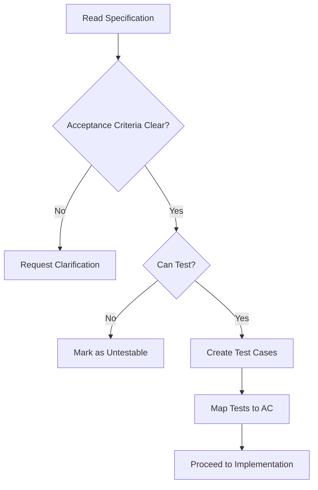
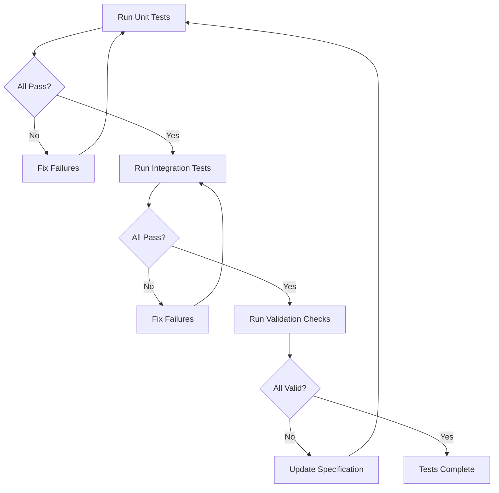
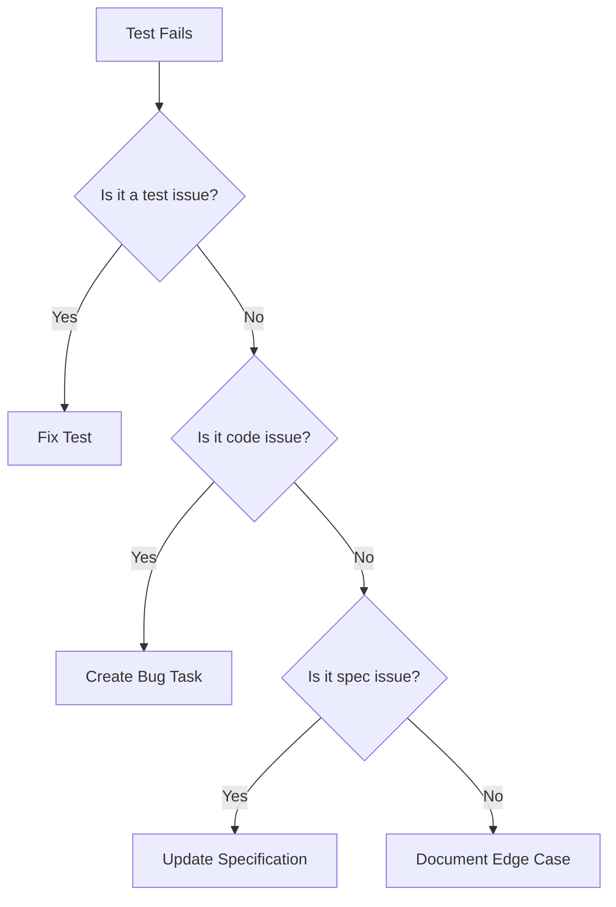

# Testing & Validation Skill

## Purpose

Ensure system correctness through systematic validation against specifications, not assumptions. This skill defines test strategies that trace directly to acceptance criteria, establish clear test boundaries, and provide consistent failure reporting.

## Core Principles

### What Testing Means

- **Specification-driven** - Tests verify WHAT was specified, not what was imagined
- **Traceable** - Every test maps to an acceptance criterion
- **Boundary-aware** - Clear distinction between unit and integration tests
- **Honest** - No testing of unspecified behavior
- **Evidence-based** - Failures provide actionable information

### What Testing Is NOT

- **Assumption testing** - "I think this should work"
- **Spec speculation** - Testing features not in the specification
- **Mock-based guessing** - Mocking external systems without contract definitions
- **Coverage theater** - High coverage without meaningful tests

---

## Test Strategy

### Test Pyramid

```
                    ┌─────────────┐
                   /   Manual      \
                  /   Testing       \
                 ┌───────────────────┐
                /  Integration Tests  \
               /   (Critical Paths)    \
              ┌─────────────────────────┐
             /     Unit Tests            \
            /   (Individual Functions)    \
           └───────────────────────────────┘
```

| Test Level | Purpose | Coverage Target | Speed Target |
|------------|---------|-----------------|--------------|
| Unit | Test individual functions | 70-80% of tests | < 100ms each |
| Integration | Test component interactions | 15-25% of tests | < 1s each |
| Manual/E2E | Test user journeys | 5-10% of tests | N/A |

### Test Selection Criteria

**Test what matters**:

| Priority | What to Test | Examples |
|----------|--------------|----------|
| P0 | Core business logic | Todo creation, validation rules |
| P0 | Data transformations | Format conversions, calculations |
| P0 | Error handling | Invalid inputs, edge cases |
| P1 | Edge cases | Empty inputs, boundary values |
| P1 | Integration points | Database, external APIs |
| P2 | UI interactions | Button clicks, form submissions |
| P2 | Performance paths | Large data sets, concurrent requests |

**Do NOT test**:

- Framework internals (tested by framework)
- Obvious getters/setters
- Third-party library behavior (trust their tests)
- Implementation details (refactoring should not break tests)

---

## Mapping Tests to Acceptance Criteria

### Traceability Matrix

Each test MUST trace to at least one acceptance criterion.

**Template**:

```markdown
## Test Traceability

| Acceptance Criterion | Test ID | Test Description | Status |
|---------------------|---------|------------------|--------|
| AC-001 | T-UT-001 | Validate email format | PASS |
| AC-002 | T-UT-002 | Reject invalid emails | PASS |
```

### Test ID Convention

| Prefix | Test Type | Example |
|--------|-----------|---------|
| T-UT- | Unit Test | T-UT-001 |
| T-INT- | Integration Test | T-INT-001 |
| T-E2E- | End-to-End Test | T-E2E-001 |
| T-VAL- | Validation Test | T-VAL-001 |

### Creating Test from Acceptance Criterion

**Acceptance Criterion**:

```markdown
### AC-001: Valid Email Submission

**Given** user is on reset page
**When** user enters valid email
**Then** system MUST display confirmation message
**And** system MUST send reset email
```

**Derived Tests**:

```markdown
## Tests for AC-001

### T-UT-001: Email Format Validation

**Test**: isValidEmail('user@example.com') returns true
**Verifies**: AC-001 - valid email detection

### T-UT-002: Invalid Email Rejection

**Test**: isValidEmail('notanemail') returns false
**Verifies**: AC-001 - invalid email detection

### T-INT-001: Reset Request Success Flow

**Test**: POST /reset with valid email returns 200
**Verifies**: AC-001 - confirmation message displayed

### T-INT-002: Email Sent on Valid Request

**Test**: Mock email service receives send request
**Verifies**: AC-001 - reset email sent
```

---

## Unit Test Guidelines

### What is a Unit Test

Test of a single function or method in isolation.

**Characteristics**:

- Tests ONE function
- Fast (< 100ms)
- No external dependencies (mocked/stubbed)
- Deterministic results
- No side effects

### Unit Test Structure

```typescript
// T-UT-XXX: [Test name]
// Verifies: [AC reference]

describe('[Function/Module Name]', () => {
  describe('[Specific Behavior]', () => {
    it('should [expected behavior] when [condition]', () => {
      // Arrange
      const input = setupTestData();

      // Act
      const result = targetFunction(input);

      // Assert
      expect(result).toEqual(expectedOutput);
    });

    it('should throw [Error] when [condition]', () => {
      // Arrange
      const invalidInput = createInvalidData();

      // Act & Assert
      expect(() => targetFunction(invalidInput))
        .toThrow(ErrorType);
    });
  });
});
```

### Unit Test Examples

**Good Unit Test**:

```typescript
// T-UT-001: Email format validation
// Verifies: AC-001

describe('isValidEmail', () => {
  it('should return true for valid email format', () => {
    // Arrange
    const validEmails = ['test@example.com', 'user.name@domain.org'];

    // Act & Assert
    for (const email of validEmails) {
      expect(isValidEmail(email)).toBe(true);
    }
  });

  it('should return false for invalid email format', () => {
    // Arrange
    const invalidEmails = ['notanemail', 'missing@domain', '@nodomain.com'];

    // Act & Assert
    for (const email of invalidEmails) {
      expect(isValidEmail(email)).toBe(false);
    }
  });
});
```

**Bad Unit Test**:

```typescript
// BAD: Testing multiple functions
it('should create user and send email', () => {
  const user = createUser({ name: 'Test', email: 'test@test.com' });
  sendEmail(user.email, 'Welcome');
  expect(user).toBeDefined();
  // This tests TWO functions - split into two tests
});
```

### Mocking Rules

| Can Mock | Cannot Mock |
|----------|-------------|
| Database calls | Core business logic |
| External APIs | Data transformations |
| Time (Date.now) | Validations |
| File system | Algorithm implementations |
| Network requests | Third-party contracts (use real tests) |

**Exception**: Integration tests with external services MUST use real contracts or contract tests, not mocks.

---

## Integration Test Guidelines

### What is an Integration Test

Test of component interactions and data flows.

**Characteristics**:

- Tests multiple components working together
- May use real dependencies (database, services)
- Slower than unit tests
- Tests interfaces and contracts
- Verifies data flows end-to-end

### Integration Test Structure

```typescript
// T-INT-XXX: [Test name]
// Verifies: [AC reference]
// Setup: [Required test data]

describe('[Component Integration]', () => {
  beforeAll(async () => {
    // Setup test database
    // Seed test data
  });

  afterAll(async () => {
    // Cleanup test data
    // Close connections
  });

  it('should [expected behavior] through full flow', async () => {
    // Arrange
    const request = createValidRequest();

    // Act
    const response = await makeRequest(request);

    // Assert
    expect(response.status).toBe(200);
    expect(response.body).toMatchObject(expectedOutput);
  });
});
```

### Integration Test Examples

**Good Integration Test**:

```typescript
// T-INT-001: Todo creation flow
// Verifies: AC-003

describe('Todo Creation API', () => {
  it('should create todo and persist to database', async () => {
    // Arrange
    const todoData = {
      title: 'Test todo',
      projectId: testProjectId,
    };

    // Act
    const response = await request(app)
      .post('/api/todos')
      .send(todoData)
      .set('Authorization', `Bearer ${testToken}`);

    // Assert
    expect(response.status).toBe(201);
    expect(response.body.id).toBeDefined();

    // Verify in database directly
    const dbTodo = await db.todos.find(response.body.id);
    expect(dbTodo.title).toBe(todoData.title);
  });
});
```

---

## Validation Checklists

### Pre-Implementation Validation

Before writing code, validate specification clarity:

```markdown
## Pre-Implementation Checklist

- [ ] All acceptance criteria are testable
- [ ] No vague language in criteria (fast, user-friendly)
- [ ] Edge cases are identified
- [ ] Error conditions are specified
- [ ] Success criteria are measurable
```

### Test Coverage Checklist

```markdown
## Test Coverage Requirements

### Functional Coverage

| Requirement | Unit Tests | Integration Tests | Covered |
|-------------|------------|-------------------|---------|
| FR-001 | T-UT-001 to T-UT-003 | T-INT-001 | YES |
| FR-002 | T-UT-004 | T-INT-002 | YES |

### Boundary Coverage

| Input Type | Test Case | Expected Result |
|------------|-----------|-----------------|
| Empty string | "" | Validation error |
| Null/undefined | null | Validation error |
| Valid input | "test@test.com" | Success |
| Malicious input | "test'; DROP TABLE" | Sanitized/Rejected |

### Error Path Coverage

| Error Condition | Test Case | Expected Behavior |
|-----------------|-----------|-------------------|
| Network failure | Simulate disconnect | Graceful degradation |
| Invalid data | Submit bad data | Clear error message |
| Permission denied | Unauthorized access | 403 response |
```

### Code Validation Checklist

```markdown
## Code Validation Before Commit

### Correctness

- [ ] Tests pass locally
- [ ] Tests pass in CI
- [ ] No flakiness (repeated runs pass)
- [ ] Tests verify acceptance criteria

### Quality

- [ ] Tests are readable
- [ ] Test names describe behavior
- [ ] No hard-coded test values without explanation
- [ ] Tests are independent (no order dependency)

### Coverage

- [ ] Critical paths covered
- [ ] Error paths covered
- [ ] Edge cases covered
- [ ] Integration points covered
```

---

## Failure Reporting Format

### Test Failure Report

```markdown
## Test Failure Report

### Summary

| Metric | Value |
|--------|-------|
| Total Tests | 150 |
| Passed | 148 |
| Failed | 2 |
| Skipped | 0 |

### Failed Tests

#### T-UT-042: [Test Name]

**Failure Type**: [ASSERTION_ERROR | TIMEOUT | SETUP_ERROR | RUNTIME_ERROR]

**Expected**:
```[expected value]```

**Actual**:
```[actual value]```

**Traceability**: AC-[XXX]

**Related Code**: [File:Line]

**Failure Message**:
```
[Full error message]
```

**Stack Trace**:
```
[Stack trace with relevant lines]
```

**Analysis**:
[Root cause analysis]

**Suggested Fix**:
[Recommended fix with task ID]
```

### Integration Failure Report

```markdown
## Integration Test Failure Report

### T-INT-015: [Test Name]

**Test Component**: [Component name]

**Environment**: [Test/Stage/Prod]

**Failure Type**: [NETWORK_ERROR | DATA_MISMATCH | TIMEOUT | SERVICE_UNAVAILABLE]

**Request**:
```json
[Request details]
```

**Response**:
```json
[Response received]
```

**Expected Response**:
```json
[Expected response]
```

**Error Details**:
```
[Error message]
```

**Traceability**: AC-[XXX]

**Impact**: [HIGH | MEDIUM | LOW]

**Root Cause**:
[Analysis]

**Recommended Action**:
[Fix with task reference]
```

### Validation Failure Report

```markdown
## Validation Failure Report

### V-001: [Validation Check Name]

**Check Type**: [SPEC_CHECK | REQUIREMENT_CHECK | BOUNDARY_CHECK]

**Specification Reference**: [spec.md section]

**Issue**:
[Description of validation failure]

**Evidence**:
- [Evidence 1]
- [Evidence 2]

**Severity**: [BLOCKER | MAJOR | MINOR]

**Recommendation**:
[Action to resolve]
```

---

## Test Strategies by Type

### Validation Testing

**Purpose**: Verify input validation rules.

```typescript
// T-VAL-001: Email validation matrix
const emailCases = [
  // Valid cases
  { input: 'test@example.com', expected: true },
  { input: 'user.name@domain.org', expected: true },
  { input: 'user+tag@example.co.uk', expected: true },

  // Invalid cases
  { input: '', expected: false },
  { input: 'notanemail', expected: false },
  { input: '@nodomain.com', expected: false },
  { input: 'spaces in@email.com', expected: false },
  { input: 'double@@at.com', expected: false },
];

emailCases.forEach(({ input, expected }) => {
  it(`should validate ${JSON.stringify(input)} as ${expected}`, () => {
    expect(isValidEmail(input)).toBe(expected);
  });
});
```

### Boundary Testing

**Purpose**: Test edge cases and boundary values.

```typescript
// T-UT-020: String length boundary
const lengthCases = [
  { input: 'a'.repeat(1), expected: 'valid' },
  { input: 'a'.repeat(100), expected: 'valid' },
  { input: 'a'.repeat(0), expected: 'too_short' },
  { input: 'a'.repeat(101), expected: 'too_long' },
];
```

### Error Handling Testing

**Purpose**: Verify error conditions are handled correctly.

```typescript
// T-UT-030: Error handling
describe('createUser', () => {
  it('should throw ValidationError for invalid email', () => {
    expect(() => createUser({ email: 'bad' }))
      .toThrow(ValidationError);
  });

  it('should throw UserExistsError for duplicate', async () => {
    await expect(createUser({ email: existing }))
      .rejects.toThrow(UserExistsError);
  });

  it('should throw DatabaseError on connection failure', async () => {
    mockDbConnectionFailure();
    await expect(createUser(validDto))
      .rejects.toThrow(DatabaseError);
  });
});
```

### Data Transformation Testing

**Purpose**: Verify data conversions and transformations.

```typescript
// T-UT-040: Data format conversion
describe('date formatting', () => {
  it('should convert ISO string to display format', () => {
    const input = '2024-01-15T10:30:00Z';
    const expected = 'Jan 15, 2024';
    expect(formatDate(input)).toBe(expected);
  });

  it('should handle timezone conversion', () => {
    const input = '2024-01-15T00:00:00Z';
    const expected = '2024-01-14T19:00:00-05:00';
    expect(convertTimezone(input, 'America/New_York')).toBe(expected);
  });
});
```

---

## Validation Workflow

### Specification Validation



### Test Execution Workflow



### Failure Investigation Workflow



---

## Test Files Structure

```
tests/
├── unit/
│   ├── [module]/
│   │   ├── [module].test.ts
│   │   └── [module].utils.test.ts
│   ├── utils/
│   └── helpers/
├── integration/
│   ├── [feature]/
│   │   ├── [feature].api.test.ts
│   │   └── [feature].flow.test.ts
│   └── setup/
├── validation/
│   ├── acceptance-criteria.test.ts
│   └── boundary-cases.test.ts
└── fixtures/
    ├── test-data.json
    └── mocks/
```

---

## Quality Gates

### Test Quality Requirements

| Requirement | Criteria |
|-------------|----------|
| **Traceability** | Every test has AC reference |
| **Isolation** | Unit tests don't depend on each other |
| **Readability** | Test names describe behavior |
| **Reliability** | Tests pass 10/10 runs |
| **Speed** | Unit < 100ms, Integration < 1s |
| **Coverage** | Critical paths 100% covered |

### Validation Requirements

| Check | Pass Criteria |
|-------|---------------|
| AC Coverage | All ACs have at least one test |
| Error Coverage | All error conditions tested |
| Boundary Coverage | All boundaries tested |
| Integration Coverage | All interfaces tested |

---

## Anti-Patterns

### Anti-Pattern 1: Test Without Traceability

**Bad**: Writing tests that don't map to acceptance criteria.

```typescript
// BAD: No AC reference
it('should work correctly', () => {
  expect(doSomething()).toBeDefined();
});
```

**Good**: Test linked to AC.

```typescript
// T-UT-001: Valid email acceptance
// Verifies: AC-003
it('should accept valid email format', () => {
  expect(isValidEmail('test@example.com')).toBe(true);
});
```

### Anti-Pattern 2: Mock Everything

**Bad**: Mocking all external dependencies without contract tests.

```typescript
// BAD: Full mock, no real validation
it('should call API', async () => {
  mockApi.success();
  const result = await fetchData();
  expect(result).toBeDefined();
});
```

**Good**: Mock with contract, integration test with real service.

```typescript
// Unit test with mock
it('should call API with correct params', () => {
  const mockApi = { send: jest.fn().mockResolvedValue(data) };
  const service = createService(mockApi);
  await service.fetch();
  expect(mockApi.send).toHaveBeenCalledWith(expectedParams);
});

// Integration test with real contract
it('should handle API response', async () => {
  const response = await realApiCall();
  expect(response).toMatchSchema(apiSchema);
});
```

### Anti-Pattern 3: Testing Implementation

**Bad**: Testing HOW something is done, not WHAT it does.

```typescript
// BAD: Testing implementation detail
it('should call database.save()', () => {
  const db = { save: jest.fn() };
  createUser(db);
  expect(db.save).toHaveBeenCalled();
});
```

**Good**: Testing behavior/outcome.

```typescript
// GOOD: Testing outcome
it('should persist user to database', async () => {
  const user = await createUser(validDto);
  const saved = await db.users.find(user.id);
  expect(saved).toEqual(user);
});
```

### Anti-Pattern 4: Coverage Theater

**Bad**: High coverage percentage without meaningful tests.

```typescript
// BAD: 100% coverage but no assertions
it('should do stuff', () => {
  const result = doStuff();
  // No assertion - still counts as coverage!
});
```

**Good**: Coverage with meaningful assertions.

```typescript
// GOOD: Actual verification
it('should return transformed data', () => {
  const result = doStuff(input);
  expect(result).toEqual(expectedOutput);
});
```

---

## Summary

Testing and validation requires:

1. **Traceability** - Every test maps to an acceptance criterion
2. **Boundaries** - Clear distinction between unit and integration tests
3. **Specification-driven** - Test what was specified, not assumed
4. **Honest** - No testing of unspecified behavior
5. **Clear reporting** - Consistent failure format with root cause
6. **Quality gates** - Automated and manual validation checkpoints